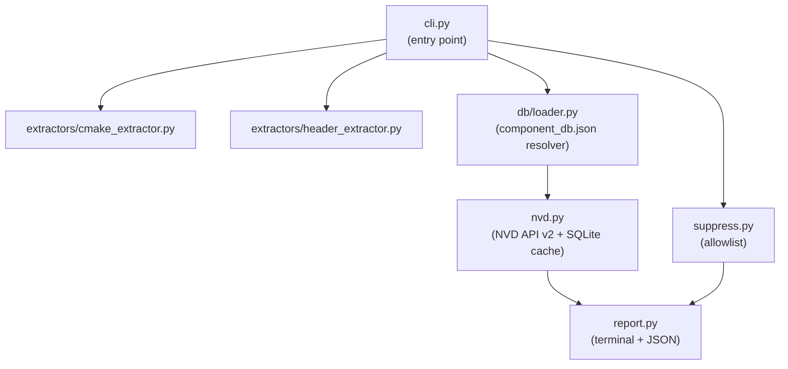

# FirmwareScan MVP Build

## Overview

Build the FirmwareScan MVP: a working CLI that extracts dependency versions from CMake files, looks them up against NVD via CPE identifiers, and produces a terminal and JSON report. Covers all P0 and P1 MVP items from the PRD.

---

## What exists

- [`db/component_db.json`](../db/component_db.json) — 10-component CPE mapping database
- [`scripts/add_component.py`](../scripts/add_component.py) and [`scripts/validate_db.py`](../scripts/validate_db.py) — DB utilities

---

## Target architecture



---

## Shared data model — `models.py`

A `Dependency` dataclass is the contract between all modules:

```python
@dataclass
class Dependency:
    name: str
    version: str | None
    confidence: str        # "high" | "medium" | "low"
    source_file: str
    line_number: int | None
    cpe: str | None        # resolved after DB lookup
```

And a `Finding` dataclass for CVE results (`cve_id`, `cvss_score`, `severity`, `description`, `nvd_url`).

---

## Task checklist

- [x] Project scaffolding — package structure and `pyproject.toml`
- [x] `models.py` — `Dependency` and `Finding` dataclasses
- [ ] `db/loader.py` — component DB resolver
- [ ] `extractors/cmake_extractor.py` — CMake extractor (P0)
- [ ] `extractors/header_extractor.py` — header extractor (P1)
- [ ] `nvd.py` — NVD API v2 client + SQLite cache (P0)
- [ ] `report.py` — terminal + JSON renderer (P0/P1)
- [ ] `suppress.py` — suppression/allowlist (P1)
- [ ] `cli.py` — entry point and orchestration (P0)
- [ ] Unit tests — db/loader, extractors, suppress
- [ ] NVD mock tests — HTTP responses, cache, backoff
- [ ] Integration test — fixture firmware project end-to-end
- [ ] `README.md` — install, usage, example output

---

## Tasks

### 1. Project scaffolding ✓

Flat layout at the project root — no nested package subdirectory:

```
cli.py
models.py
nvd.py
report.py
suppress.py
db/
  loader.py
  component_db.json
extractors/
  __init__.py
  base.py
  cmake_extractor.py
  header_extractor.py
pyproject.toml
tests/
```

### 2. `models.py` — shared dataclasses ✓

`Dependency` and `Finding` dataclasses. Used by every module.

### 3. `db/loader.py` — component DB resolver

Loads `component_db.json`, matches a `Dependency.name` against `name` + `aliases`, returns the CPE template with version interpolated. Components with `cpe_template: null` (littlefs, FatFs) get a CPE of `None` and a note in the report.

### 4. `extractors/cmake_extractor.py` — P0 extractor

Parses `CMakeLists.txt` for:

- `FetchContent_Declare(<name> GIT_TAG <version>)`
- `ExternalProject_Add(<name> ... VERSION <ver>)`
- `find_package(<name> <version>)`

Cross-references `cmake_fetch_names` in the DB to resolve to canonical component name. Returns `List[Dependency]` with `confidence="high"` when version is explicit.

### 5. `extractors/header_extractor.py` — P1 extractor

Walks source tree for `version.h`, `*_version.h`, `*_version.c` etc. Applies the `version_patterns` regex list from the DB. Returns `List[Dependency]` with `confidence="medium"`.

### 6. `nvd.py` — NVD API v2 client + SQLite cache

- Queries `https://services.nvd.nist.gov/rest/json/cves/2.0?cpeName=<cpe>`
- SQLite cache at `~/.firmwarescan/cache.db`, keyed by CPE string, default TTL 24 hours
- Exponential backoff on 429 / 503
- Optional `NVD_API_KEY` env var for higher rate limits
- Returns `List[Finding]`

### 7. `report.py` — terminal + JSON renderer

- **Terminal:** Severity-coloured summary header, per-finding table (component, version, CVE, CVSS, description truncated to 80 chars, NVD link). ANSI codes only — no third-party deps.
- **JSON:** Structured dict matching the finding fields, written to stdout or `--output <file>`.

### 8. `suppress.py` — basic suppression

Reads a `.firmwarescan.yml` file containing a `suppress:` block. Each entry requires `cve_id`, `reason`, and an optional `expires` date. Filters the `Finding` list before reporting and warns when a suppression has expired.

```yaml
suppress:
  - cve_id: CVE-2021-31571
    reason: "Not exploitable — we don't use the affected API"
    expires: 2026-12-01
```

Custom component CPE mappings are out of MVP scope — add new components directly to `db/component_db.json` instead.

### 9. `cli.py` — entry point

```
firmwarescan [PATH] [--format terminal|json] [--fail-on CRITICAL|HIGH|MEDIUM] [--config .firmwarescan.yml]
```

Orchestrates: discover → DB resolve → NVD lookup → suppress → report → exit code.

### 10. Tests

Tests live in `tests/` using `pytest`.

```
tests/
  fixtures/
    cmake/
      CMakeLists_freertos.txt       ← FreeRTOS 10.4.3 via FetchContent
      CMakeLists_multi.txt          ← multiple components
      CMakeLists_no_version.txt     ← version-less declaration (edge case)
    headers/
      FreeRTOS_version.h            ← version header fixture
    firmware_project/               ← integration test fixture
      CMakeLists.txt                ← old lwIP 2.1.2 + FreeRTOS 10.0.1
  test_db_loader.py
  test_cmake_extractor.py
  test_header_extractor.py
  test_nvd.py                       ← all HTTP calls mocked with unittest.mock
  test_suppress.py
  test_integration.py               ← end-to-end against fixture project
```

**Unit tests** (no network, no filesystem side-effects):

- `test_db_loader.py` — alias resolution, CPE template interpolation, null-CPE components
- `test_cmake_extractor.py` — all three CMake patterns, version-less edge case, unknown component passthrough
- `test_header_extractor.py` — pattern matching per component, confidence level assignment
- `test_suppress.py` — active suppression filters finding, expired suppression emits warning

**NVD mock tests** (`test_nvd.py`):

- Successful response parsed into `Finding` list
- Cache hit skips HTTP call
- 429 triggers backoff retry
- Offline mode returns cached data when available, raises gracefully when not

**Integration test** (`test_integration.py`):

- Points scanner at `tests/fixtures/firmware_project/` with NVD calls mocked to return a known CVE for lwIP 2.1.2
- Asserts the finding appears in the report output and exit code is non-zero when `--fail-on HIGH`
- Asserts a known-clean dependency list produces no findings and exit code 0

This satisfies the PRD success metric: "Zero false positives on a known-clean dependency list in regression testing."

### 11. `pyproject.toml` + `README.md`

- Runtime dep: `requests` only
- Dev deps: `pytest`, `pytest-cov`
- `README.md` with install instructions, usage examples, and example terminal output

---

## Scope boundaries (post-MVP)

- Binary string extraction (`BinaryExtractor`) — v0.2
- SARIF output, GitHub Actions template — v0.2
- Makefile extractor — v0.2
